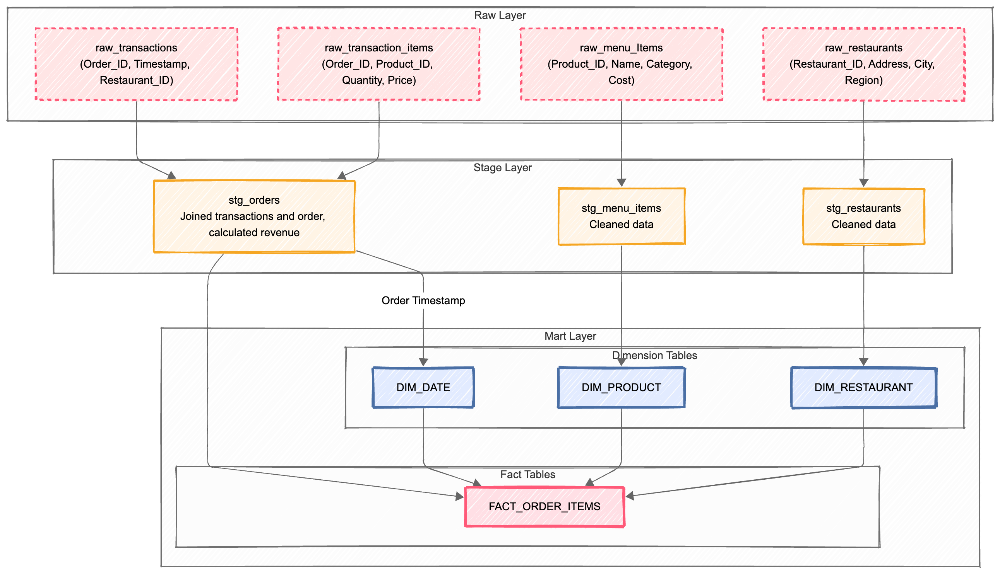
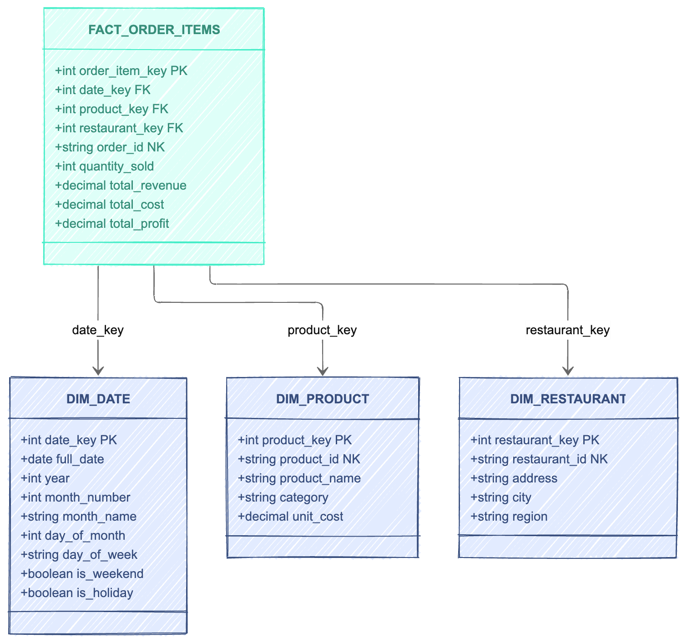

# Team:
* [Bohdan Hupalo](https://github.com/senatede)
* [Lesia Malych](https://github.com/malilless)
* [Yuliia Kupchynska](https://github.com/Yuliia-Kupchynska)

### [BigQuery Project Link](https://console.cloud.google.com/bigquery?project=homework3-478220)

# Lineage Graph:

# Raw Data:
We used `generate.py` script to generate raw data sources(with occasional null values and duplicate)
* `raw_menu_items.csv` - 55 rows
* `raw restaurants.csv` - 110 rows
* `raw_transactions.csv` - 10500 rows
* `raw_transaction_items.csv` - 36728 rows

# Stage Layer:
We used queries `stg_menu_items.sql` and `stg_restaurants.sql` to just clean the data from null values and duplicates

And query `stg_menu_items.sql` to join cleaned `raw_transaction_items` and `raw_transactions` tables.

# Mart Layer:

## Dimensions:

We used single query Dim_tables_creation.sql to create 3 DIM tables dim_date, dim_restaurant and dim_product from stage layer data.

## Factual Table:
We used query `Fact_table_creation.sql` to create factual table `fact_order_items`.

# Main query
Now that we have completed Mart layer we can use simple query `main_query.sql` to calculate total profit for each category in Kyiv region from 3 last months of the year.
